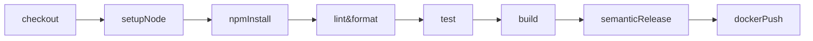

# MidasTS – Meta Document

> **Propósito**  
> Plataforma de trading algorítmico en tiempo real para spot‑crypto,  
> basada en arquitectura hexagonal, con adaptadores a Binance,  
> DeepSeek AI, LunarCrush y Telegram.  

---

## 1. Mantenimiento

| Campo            | Valor                                     |
| ---------------- | ----------------------------------------- |
| Owner            | **Ernesto Cobos** <ernesto@cobos.io>      |
| GitHub user      | @ErnestoCobos                             |
| Primary language | TypeScript 5.x (ES2022 target)            |
| Package manager  | npm 10.9.2                                  |
| Node runtime     | **≥ 22.15** LTS                            |
| Repo visibility  | Private _(cambiar antes del launch)_      |
| License          | MIT (draft)                               |

### Code Owners

```
# CODEOWNERS
*       @ErnestoCobos
core/*  @ErnestoCobos
```

---

## 2. Arquitectura

* **Hexagonal / Ports & Adapters**  
  `core` (dominio + aplicación) **↔** `ports` **↔** `adapters`  
* **Paradigma mixto**  
  * OOP → componentes con estado (Portfolio, ExchangeAdapter, etc.)  
  * FP → cálculo puro (indicadores, scoring, pipes asíncronos)  
  Directrices detalladas en `15‑paradigm-choice.md`.

---

## 3. Calidad y flujo local (Reglas Cline)

| Orden | Regla                 | Disparador                |
| ----- | --------------------- | ------------------------- |
| 1     | **10‑ts‑standards**   | guardado de archivo       |
| 2     | **15‑paradigm-choice**| guardado de archivo       |
| 3     | **20‑architecture**   | guardado + pre‑commit     |
| 4     | **30‑lint‑format**    | pre‑commit                |
| 5     | **40‑tests**          | task_done / guardado      |
| 6     | **50‑auto‑commit**    | guardado / task_done      |

> Localmente fallan en **warn**; en CI se elevan a **error**.

---

## 4. CI/CD (GitHub Actions)



* **semantic-release** publica tags y genera changelog a partir de Conventional Commits.  
* `main` branch protegido → requiere lint, test y Architecture Guard OK.

---

## 5. Tests & cobertura

* **Vitest** + `@testing-library` para units/integration  
* Cobertura mínima: **85 %** líneas / statements  
* Reportes HTML almacenados en artefacts de CI.  
* Backtests automáticos ejecutados en cada Pull Request.  
* Pruebas de resiliencia mediante chaos-engineering liviano (e.g., kube-monkey).

---

## 6. Herramientas clave

| Herramienta | Rol |
| ----------- | --- |
| **ESLint** (`flat` config) | Reglas strict TypeScript, import order |
| **Prettier** | Formato consistente (100 cols, comillas simples) |
| **tsup**     | Bundling ESM + d.ts                                 |
| **Madge**    | Detección de ciclos                                 |
| **tsyringe** | DI container para adaptadores                       |
| **Vitest**   | Pruebas rápidas y coverage                          |
| **Conventional Commits** | Mensajes de commit + release notes      |
| **OpenTelemetry** | Instrumentación para trazas distribuidas       |
| **Prometheus/Grafana** | Monitoreo de métricas clave               |

---

## 7. Entorno & secretos

| Variable           | Descripción                            |
| ------------------ | -------------------------------------- |
| `BINANCE_KEY`      | API key spot                           |
| `BINANCE_SECRET`   | API secret spot                        |
| `DEEPSEEK_API_KEY` | Llave de modelo Reasoner               |
| `LUNARCRUSH_KEY`   | API key para datos de LunarCrush       |
| `DB_*`             | Credenciales PostgreSQL Neon/Vultr     |
| `TELEGRAM_*`       | Token y users del bot                  |

> **Nunca** subir `.env` al repo.  
> Los commits automáticos bloquean líneas que contengan `*_KEY`, `*_TOKEN`, `SECRET`.

---

## 8. Ramas y versión

* **main** – estable, producciones empaquetables  
* **feat/***, **fix/*** – ramas cortas; squash & merge  
* Versionado **semver** generado por `semantic-release`.

---

## 9. Roadmap breve

1. 📈 MVP trading spot con órdenes market/limit  
2. 🛑 Motor de riesgo + trailing stops  
3. 🤖 Integración Reasoner v2 para señales multi‑modal  
4. ☁️ Despliegue en Kubernetes (DigitalOcean → Vultr MX)  
5. 🛰️ Dashboard real‑time (Next.js + tRPC)  

---