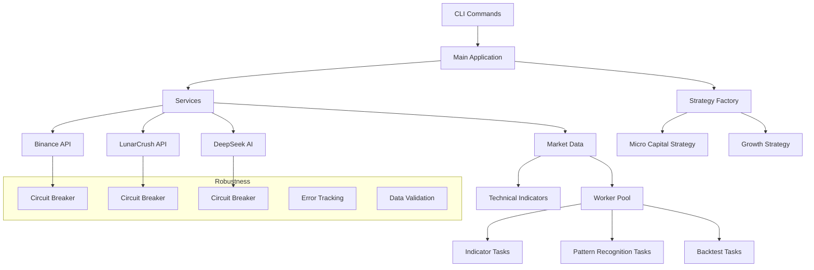

# Arquitectura y Patrones de Diseño - midasTS

Este documento describe la arquitectura y patrones de diseño implementados en el sistema midasTS para trading algorítmico de criptomonedas.

## Componentes del Sistema

El sistema midasTS está organizado en varios componentes principales que funcionan de manera cohesiva:

```
midasTS/
├── src/
│   ├── services/           # Servicios externos e internos
│   ├── strategies/         # Estrategias de trading
│   ├── utils/              # Utilidades y herramientas
│   └── index.ts            # Punto de entrada
└── docs/                   # Documentación
```

## Diagrama de Arquitectura



## Patrones de Diseño e Implementaciones

### 1. Gestión de Errores y Telemetría

#### 1.1 Sentry Integration (`utils/error-tracking.ts`)

- **Patrón implementado**: Observer (para capturar errores)
- **Descripción**: Integración con Sentry para capturar, registrar y monitorear errores en tiempo real. 
- **Beneficios**:
  - Detección temprana de errores en producción
  - Información detallada sobre las condiciones del error
  - Notificaciones automáticas por errores críticos

#### 1.2 Validación de Datos con Zod (`utils/validation.ts`)

- **Patrón implementado**: Schema Validation
- **Descripción**: Utiliza la biblioteca Zod para validar datos y garantizar la integridad.
- **Ejemplos de uso**:
  - Validación de parámetros de API
  - Esquemas para datos de entrada de estrategias
  - Validación de configuración de trading

### 2. Patrones de Resiliencia

#### 2.1 Circuit Breaker (`utils/circuit-breaker.ts`)

- **Patrón implementado**: Circuit Breaker
- **Descripción**: Protege contra fallos en servicios dependientes como Binance API.
- **Comportamiento**:
  - Estado cerrado (normal): Las solicitudes pasan al servicio
  - Estado abierto: Solicitudes rechazadas inmediatamente si el servicio está inestable
  - Estado semi-abierto: Estado de prueba para verificar si el servicio se ha recuperado
- **Configuración**:
  - Umbral de fallos para abrir el circuito
  - Tiempo de reset para pasar de abierto a semi-abierto
  - Umbral de éxitos para cerrar el circuito desde estado semi-abierto

### 3. Optimización de Rendimiento

#### 3.1 Sistema de Caché

- **Patrón implementado**: Cache-Aside
- **Descripción**: Implementa caché para datos frecuentemente accedidos con TTL (Time To Live).
- **Beneficios**:
  - Reduce carga en APIs externas
  - Mejora tiempos de respuesta
  - Funciona en modo offline con datos en caché

#### 3.2 Cola de Rate-Limiting

- **Patrón implementado**: Throttling
- **Descripción**: Controla el flujo de solicitudes a APIs con límites de tasa.
- **Implementación**: Utiliza p-queue para gestionar colas de solicitudes.

#### 3.3 Worker Pool para Procesamiento Paralelo (`utils/worker-pool.ts`)

- **Patrón implementado**: Thread Pool
- **Descripción**: Implementa procesamiento en paralelo usando Worker Threads.
- **Casos de uso**:
  - Cálculo intensivo de indicadores técnicos
  - Backtesting de estrategias
  - Análisis de patrones

### 4. Patrones Arquitectónicos

#### 4.1 Registry Pattern

- **Implementación**: CircuitBreakerRegistry
- **Descripción**: Registro centralizado para acceder a instancias de Circuit Breaker.

#### 4.2 Factory Pattern

- **Implementación**: StrategyFactory
- **Descripción**: Factoría para crear e instanciar diferentes estrategias de trading.

#### 4.3 Service Layer

- **Implementación**: Servicios en `/services`
- **Descripción**: Encapsula lógica de acceso a APIs externas y funcionalidades coherentes.

### 5. Buenas Prácticas

#### 5.1 Documentación Extensiva

- JSDoc en todas las clases, métodos y funciones
- Documentación especializada para componentes complejos
- Diagramas para visualizar arquitectura y flujos

#### 5.2 Estilo de Código Consistente

- Uso de TypeScript para type safety
- Patrones de error handling uniformes
- Nomenclatura consistente siguiendo principios de clean code

## Ejemplos de Implementación

### Circuit Breaker para Binance API

```typescript
// Obtener circuit breaker para Binance
const breaker = CircuitBreakerRegistry.getOrCreate('binance', {
  failureThreshold: 3,
  resetTimeout: 30000,
  halfOpenSuccessThreshold: 2
});

try {
  // Ejecutar la operación protegida por circuit breaker
  return await breaker.execute(
    async () => {
      // Implementación real...
    },
    'operationName'
  );
} catch (error) {
  // Manejo de errores y fallback
}
```

### Validación de Datos con Zod

```typescript
const marketDataSchema = z.object({
  price: z.number().positive(),
  volume24h: z.number().positive(),
  sentiment: z.number().min(0).max(100)
});

// Función de validación
function validateMarketData(data: unknown): MarketData {
  try {
    return marketDataSchema.parse(data);
  } catch (error) {
    // Manejo de errores de validación
    throw new Error(`Datos de mercado inválidos: ${error.message}`);
  }
}
```

### Procesamiento Paralelo con Worker Pool

```typescript
// Uso del worker pool
const result = await workerPool.runTask('calculate-indicators', {
  candles: historicalData,
  indicators: ['rsi', 'bollingerBands', 'supportResistance']
});

// Definición de una tarea
registerTaskHandler('calculate-indicators', async (data) => {
  // Procesamiento intensivo de cálculos
  return {
    rsi: calculateRSI(data.candles),
    bollingerBands: calculateBollingerBands(data.candles),
    // ...
  };
});
```

## Configuración del Sistema

La inicialización del sistema está centralizada en `utils/init.ts`:

```typescript
export function initializeSystem(): void {
  // Inicializar tracking de errores
  initSentry();
  
  // Inicializar worker pool
  workerPool.initialize();
  
  // Configurar circuit breakers
  setupCircuitBreakers();
  
  // Otros componentes...
}
```

## Ventajas de la Arquitectura Implementada

1. **Mayor Robustez**: El sistema puede manejar fallos en servicios externos sin afectar la operación principal.
2. **Escalabilidad**: Los workers permiten aprovechar sistemas multi-core para cálculos intensivos.
3. **Mantenibilidad**: Patrones consistentes y modularidad facilitan la evolución del código.
4. **Observabilidad**: Integración de telemetría para monitoreo y diagnóstico.
5. **Extensibilidad**: Arquitectura que permite añadir nuevos componentes y estrategias fácilmente.
