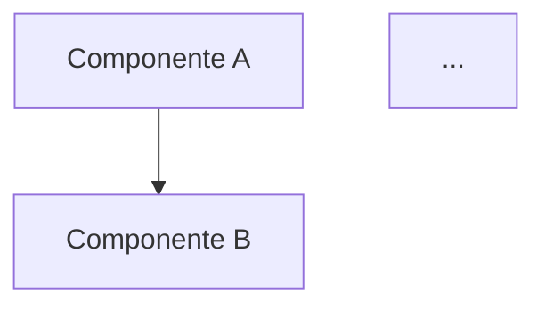

# Guía de Documentación y Roadmap

Este documento proporciona una visión general de la documentación existente y un plan para el desarrollo futuro de la documentación del sistema midasTS.

## Documentación Actualizada

La documentación ha sido actualizada para reflejar el estado actual del sistema y sus componentes:

| Documento | Estado | Descripción |
|-----------|--------|-------------|
| [README.md](README.md) | ✅ Actualizado | Visión general del sistema y puntos de entrada |
| [Arquitectura](architecture.md) | ✅ Actualizado | Diagrama de arquitectura y patrones de diseño |
| [Gestor de Portafolio](portfolio-manager.md) | ✅ Actualizado | Sistema de rotación de activos |
| [Escáner de Mercado](market-scanner.md) | ✅ Completo | Algoritmo de puntuación de oportunidades |
| [Integración DeepSeek](deepseek-integration.md) | ✅ Actualizado | Proceso de decisión en dos etapas |
| [Sistema de Feedback](feedback-system.md) | ✅ Nuevo | Sistema de aprendizaje continuo |
| [Integración LunarCrush](lunarcrush-integration.md) | ✅ Nuevo | Análisis de sentimiento social |
| [Worker Pool](worker-pool.md) | ✅ Nuevo | Sistema de procesamiento paralelo |
| [Base de Datos](database.md) | ✅ Completo | Estructura y acceso a datos |
| [Interfaz de Línea de Comandos](command-line-interface.md) | ✅ Completo | Comandos y opciones disponibles |
| [Indicadores Técnicos](technical-indicators.md) | ✅ Nuevo | Algoritmos de análisis técnico |
| [Gestión de Riesgo](risk-management.md) | ✅ Nuevo | Estrategias de protección de capital |
| [Criterio de Kelly](kelly-criterion.md) | ✅ Nuevo | Optimización de tamaño de posiciones |

## Documentación Pendiente

Los siguientes documentos están planificados para completar la documentación del sistema:

| Documento | Prioridad | Descripción |
|-----------|-----------|-------------|
| Repositorios | Media | Documentación del patrón Repository y uso de cachés |
| Integración con Binance | Media | Detalles de la interacción con Binance API |
| Estrategias de Trading | Alta | Documentación de las estrategias implementadas |
| Matriz de Correlación | Media | Explicación del análisis de correlación |
| Guía de Desarrollo | Alta | Instrucciones para extender el sistema |
| API Interna | Baja | Documentación de interfaces internas del sistema |
| Troubleshooting | Media | Solución de problemas comunes |

## Roadmap de Documentación

Plan de desarrollo futuro para la documentación:

### Q2 2025
- Completar documentación de Estrategias de Trading
- Completar Guía de Desarrollo
- Actualizar código de ejemplo en documentación existente

### Q3 2025
- Añadir diagramas de secuencia para flujos principales
- Incorporar ejemplos interactivos a la documentación
- Crear documentación de Integración con Binance

### Q4 2025
- Implementar documentación de API con OpenAPI/Swagger
- Crear repositorio dedicado para documentos técnicos
- Añadir tutoriales paso a paso para casos de uso comunes

## Buenas Prácticas para la Documentación

Para mantener la documentación actualizada y útil:

1. **Actualizar con cada cambio significativo**: Cada nueva funcionalidad o cambio importante debe actualizar la documentación correspondiente
2. **Mantener consistencia de estilo**: Usar el mismo formato y tono en toda la documentación
3. **Incluir ejemplos de código**: Siempre incluir ejemplos prácticos de uso
4. **Usar diagramas**: Los diagramas ayudan a entender conceptos complejos
5. **Documentar APIs internas**: No solo interfaces externas
6. **Mantener una sección de FAQ**: Las preguntas frecuentes ayudan a nuevos usuarios
7. **Revisión periódica**: Revisar la documentación al menos trimestralmente

## Estructura Recomendada para Nuevos Documentos

```markdown
# Título del Documento

Breve descripción (1-2 párrafos) que explique el propósito y contexto.

## Funcionalidades Principales

- **Funcionalidad 1**: Breve descripción
- **Funcionalidad 2**: Breve descripción
- ...

## Diagrama de Arquitectura/Flujo



## Implementación Técnica

### Componente 1

```typescript
// Ejemplo de código relevante
function ejemplo() {
  // ...
}
```

### Componente 2

...

## Casos de Uso

1. **Caso 1**: Descripción y ejemplo
2. **Caso 2**: Descripción y ejemplo
...

## Consideraciones Especiales

...

## Mejores Prácticas

1. ...
2. ...
...

## Desarrollo Futuro

...
```

## Formatos de Documentación Soportados

- **Markdown**: Formato principal para toda la documentación
- **Diagramas Mermaid**: Para diagramas y visualizaciones
- **Bloques de Código TypeScript**: Para ejemplos de código
- **Tablas Markdown**: Para datos estructurados
- **Listas**: Para enumeraciones y pasos

## Ubicación de la Documentación

La documentación se encuentra en el directorio `/docs` del repositorio principal. Al agregar nuevos documentos, actualizar el índice en `docs/README.md` para mantener la estructura organizada.
