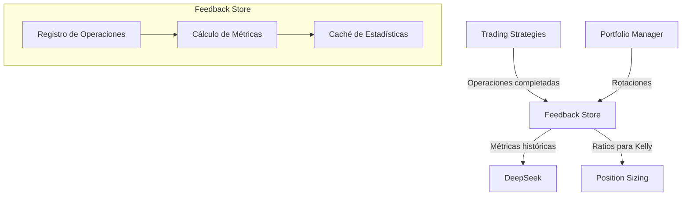

# Sistema de Feedback y Aprendizaje

El Sistema de Feedback es un componente fundamental en midasTS que permite que el sistema aprenda de sus decisiones pasadas y mejore continuamente. Este documento explica cómo funciona el sistema, qué métricas recopila y cómo se utilizan para optimizar decisiones futuras.

## Funcionalidades Principales

- **Recopilación de resultados de trading**: Registra operaciones completadas con sus resultados
- **Análisis estadístico por símbolo**: Calcula métricas de rendimiento específicas para cada activo
- **Integración con DeepSeek IA**: Proporciona contexto histórico para mejorar decisiones
- **Optimización continua**: Adapta estrategias basadas en patrones de éxito y fracaso
- **Métricas para Kelly Criterion**: Calcula ratios de ganancias/pérdidas para optimizar tamaños de posición

## Arquitectura del Sistema

El Sistema de Feedback sigue una arquitectura simple pero efectiva:



## Tipos de Datos y Estructura

### FeedbackEntry

La unidad básica de información en el sistema, que contiene:

```typescript
interface FeedbackEntry {
  originalSignal: TradeSignal;     // La señal original de DeepSeek
  marketData: MarketData;          // Datos de mercado al momento de la decisión
  result: TradeResult;             // Resultado final de la operación
  successful: boolean;             // Evaluación global de éxito
}
```

### TradeResult

Cada resultado de operación registra información detallada:

```typescript
interface TradeResult {
  symbol: string;                // Par de trading (ej: BTCUSDT)
  timestamp: number;             // Momento de la operación
  action: 'BUY' | 'SELL';        // Tipo de operación
  entryPrice: number;            // Precio de entrada
  exitPrice?: number;            // Precio de salida (si completada)
  stopLossHit?: boolean;         // Si se activó el stop loss
  takeProfitHit?: boolean;       // Si se alcanzó el take profit
  profitPercentage?: number;     // Ganancia/pérdida porcentual
  profitAmount?: number;         // Ganancia/pérdida absoluta
  positionSize: number;          // Tamaño de la posición
  holdDuration?: number;         // Duración en minutos
  marketCondition?: string;      // Condición de mercado
  confidenceScore: number;       // Confianza original de DeepSeek
  reasoning?: string;            // Razonamiento de la decisión
}
```

## Métricas Calculadas

Para cada símbolo, el sistema calcula:

| Métrica | Descripción | Uso |
|---------|-------------|-----|
| `successRate` | Porcentaje de operaciones exitosas | Evaluar efectividad global |
| `totalTrades` | Número total de operaciones | Evaluar significancia estadística |
| `avgProfit` | Ganancia promedio porcentual | Estimar potencial de retorno |
| `winRate` | Porcentaje de operaciones con ganancia | Cálculos de Kelly |
| `avgHoldDuration` | Duración promedio de operaciones | Optimizar timing |
| `payoffRatio` | Ratio de ganancia promedio / pérdida promedio | Cálculos de Kelly |

## Implementación Técnica

El sistema utiliza las siguientes técnicas para garantizar eficiencia y fiabilidad:

### Caché para Consultas Rápidas

```typescript
this.cache = new NodeCache({ stdTTL: 24 * 60 * 60 }); // 24 horas TTL
```

Esto permite acceder rápidamente a estadísticas calculadas sin recalcular en cada consulta.

### Validación de Datos

El sistema utiliza Zod para validar cada entrada:

```typescript
// Validar el resultado
tradeSignalSchema.parse(entry.result);
```

Esto garantiza integridad de datos y previene errores en cálculos estadísticos.

### Limitación de Datos

Para prevenir problemas de memoria:

```typescript
// Limitar tamaño máximo
if (this.results.length > this.MAX_ENTRIES) {
  this.results.shift(); // Eliminar el más antiguo
}
```

## Integración con DeepSeek IA

El feedback se incorpora en los prompts para DeepSeek de dos formas:

### 1. Estadísticas Globales

Proporciona una visión general del rendimiento histórico para el activo:

```
ESTADÍSTICAS HISTÓRICAS:
- Operaciones totales: 12
- Tasa de éxito: 67.0%
- Tasa de ganancia: 75.0%
- Ganancia promedio: 2.8%
- Duración promedio: 35 minutos
```

### 2. Operaciones Recientes

Proporciona contexto sobre resultados específicos recientes:

```
RESULTADOS RECIENTES:
- BUY a $135.20: ÉXITO (+2.1%, duración: 45 min)
- BUY a $128.50: FRACASO (-1.2%, duración: 30 min)
- BUY a $142.70: ÉXITO (+3.2%, duración: 60 min)
```

## Uso para Criterio de Kelly

El sistema proporciona datos específicos para optimizar dimensionamiento de posiciones:

```typescript
getPayoffRatioForSymbol(symbol: string): number {
  // Calcular ganancias y pérdidas promedio
  const avgProfit = /* cálculo de ganancia promedio */;
  const avgLoss = /* cálculo de pérdida promedio */;
  
  // Ratio para Kelly: ganancia promedio / pérdida promedio
  return avgLoss > 0 ? avgProfit / avgLoss : 1;
}
```

Este dato es esencial para calcular el tamaño óptimo de posición según el Criterio de Kelly.

## Ejemplos de Uso del Sistema

### Registro de una Operación Completada

```typescript
// Registrar una operación completada
feedbackStore.recordFeedback({
  originalSignal: {
    action: 'BUY',
    confidence: 0.92,
    entry: 135.20,
    stopLoss: 133.50,
    takeProfit: 138.60
  },
  marketData: {
    price: 135.20,
    volume24h: 980000000,
    sentiment: 85
  },
  result: {
    symbol: 'SOLUSDT',
    timestamp: Date.now(),
    action: 'BUY',
    entryPrice: 135.20,
    exitPrice: 138.60,
    profitPercentage: 2.5,
    profitAmount: 0.85,
    positionSize: 34.0,
    holdDuration: 45,
    confidenceScore: 0.92,
    takeProfitHit: true
  },
  successful: true
});
```

### Consulta para Decisión de Trading

```typescript
// Obtener estadísticas para un símbolo
const stats = feedbackStore.getSuccessRateForSymbol('BTCUSDT');
const recentFeedback = feedbackStore.getRelevantFeedback('BTCUSDT', 'BUY');

console.log(`Tasa de éxito para BTCUSDT: ${stats.successRate * 100}%`);
console.log(`Operaciones totales: ${stats.totalTrades}`);
```

## Beneficios y Resultados

El Sistema de Feedback proporciona importantes beneficios:

1. **Mejora continua**: Las decisiones mejoran en función de resultados pasados
2. **Personalización por activo**: Estrategias adaptadas a cada criptomoneda
3. **Adaptación a condiciones cambiantes**: Aprende de cambios en el mercado
4. **Optimización de parámetros**: Ajusta take profit, stop loss y tamaño de posición
5. **Transparencia y auditoría**: Mantiene un registro completo de operaciones

## Desarrollo Futuro

Áreas de mejora previstas para el Sistema de Feedback:

1. **Análisis por condiciones de mercado**: Segmentar feedback por tendencias globales
2. **Correlación con indicadores técnicos**: Identificar qué indicadores predicen mejor el éxito
3. **Exportación para entrenamiento de ML**: Preparar datasets para modelos de machine learning
4. **Persistencia en base de datos**: Almacenar historial completo en PostgreSQL/TimescaleDB
5. **Visualizaciones interactivas**: Dashboards para análisis de rendimiento
