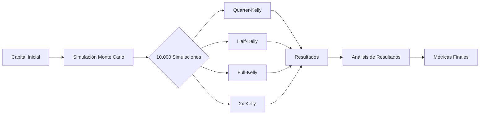

# Criterio de Kelly

El Criterio de Kelly es un pilar fundamental en la estrategia de gestión de capital de midasTS, especialmente importante para optimizar el crecimiento de micro-capital. Este documento explica la implementación y adaptaciones específicas del Criterio de Kelly en el sistema.

## Fundamentos del Criterio de Kelly

El Criterio de Kelly, desarrollado por John L. Kelly Jr. en 1956, es una fórmula matemática que determina el tamaño óptimo de una serie de apuestas para maximizar el crecimiento logarítmico del capital a largo plazo.

### Fórmula Básica

```
f* = (p × b - q) / b
```

Donde:
- `f*` = Fracción óptima del capital a invertir
- `p` = Probabilidad de ganar
- `q` = Probabilidad de perder (1 - p)
- `b` = Relación ganancia/pérdida (payoff ratio)

### Ejemplo Simplificado

Si tenemos:
- Win rate = 60% (p = 0.6)
- Payoff ratio = 1:1 (b = 1)

Entonces:
```
f* = (0.6 × 1 - 0.4) / 1 = 0.2
```

Esto significa que deberíamos invertir el 20% de nuestro capital en cada operación para maximizar el crecimiento a largo plazo.

## Implementación en midasTS

En midasTS, el Criterio de Kelly está implementado con varias adaptaciones específicas para trading de criptomonedas con micro-capital:

### 1. Cálculo del Tamaño de Posición

```typescript
export function calculateKellyPositionSize(
  capital: number,
  winRate: number,
  payoffRatio: number,
  maxRiskPercent: number = 2
): number {
  // Validar datos de entrada
  if (!winRate || !payoffRatio || winRate <= 0 || payoffRatio <= 0) {
    return capital * 0.1; // 10% del capital como fallback seguro
  }
  
  // Fórmula de Kelly: f* = (bp - q) / b
  const kellyFraction = (payoffRatio * winRate - (1 - winRate)) / payoffRatio;
  
  // Media-Kelly (más conservador para micro-capital)
  const reducedKelly = kellyFraction * 0.5;
  
  // Aplicar restricciones adicionales
  const maxAllowedSize = capital * 0.25; // Máximo 25% del capital
  const riskBasedSize = (capital * (maxRiskPercent / 100)) / (1 - payoffRatio);
  
  // Tomar el valor más restrictivo
  const positionSize = Math.min(
    capital * reducedKelly,
    maxAllowedSize,
    riskBasedSize
  );
  
  return Math.max(positionSize, 0);
}
```

### 2. Obtención de Parámetros de Entrada

El win rate y el payoff ratio se obtienen de:

1. **Datos históricos** del sistema de feedback para cada símbolo
2. **Análisis técnico** para estimar la probabilidad y ratio de ganancia/pérdida
3. **Estimaciones de DeepSeek IA** cuando no hay datos históricos suficientes

```typescript
async function getKellyParameters(symbol: string): Promise<{winRate: number, payoffRatio: number}> {
  // 1. Intentar obtener del sistema de feedback
  const symbolStats = feedbackStore.getSuccessRateForSymbol(symbol);
  
  if (symbolStats.totalTrades >= 5) {
    return {
      winRate: symbolStats.successRate,
      payoffRatio: feedbackStore.getPayoffRatioForSymbol(symbol)
    };
  }
  
  // 2. Estimar basado en análisis técnico
  const technicals = await getTechnicalAnalysis(symbol);
  let estimatedWinRate = 0.5; // Valor neutral
  
  // Ajustar según RSI
  if (technicals.rsi < 30) {
    estimatedWinRate += 0.1; // Sobreventa, mayor probabilidad de éxito
  } else if (technicals.rsi > 70) {
    estimatedWinRate -= 0.1; // Sobrecompra, menor probabilidad
  }
  
  // Ajustar según soporte/resistencia
  if (technicals.nearSupport) {
    estimatedWinRate += 0.05;
  }
  
  // Ajustar según tendencia
  if (technicals.emaTrend === 'bullish') {
    estimatedWinRate += 0.05;
  }
  
  // Estimar payoff ratio basado en bandas de Bollinger
  const bband = technicals.bollinger;
  const potentialUpmove = bband.upper / technicals.price - 1;
  const potentialDownmove = 1 - bband.lower / technicals.price;
  
  const payoffRatio = potentialUpmove / potentialDownmove;
  
  return {
    winRate: Math.max(0.4, Math.min(0.7, estimatedWinRate)), // Limitar entre 40-70%
    payoffRatio: Math.max(0.8, Math.min(2.5, payoffRatio)) // Limitar entre 0.8-2.5
  };
}
```

## Adaptaciones para Micro-Capital

Para operaciones con micro-capital, el sistema implementa varias adaptaciones al Criterio de Kelly estándar:

### 1. Media-Kelly (Half-Kelly)

Usamos el 50% de la fracción de Kelly recomendada, lo que sacrifica algo de crecimiento óptimo a cambio de una reducción sustancial en la volatilidad del capital.

```typescript
// Media-Kelly para mayor seguridad
const reducedKelly = kellyFraction * 0.5;
```

### 2. Límites Máximos Absolutos

Independientemente del resultado de Kelly, se imponen límites máximos para evitar concentraciones excesivas:

| Capital | Límite Máximo | Razón |
|---------|---------------|-------|
| <$100   | 20%           | Preservación de capital prioritaria |
| $100-$500 | 25%         | Balance preservación/crecimiento |
| >$500   | 30%           | Mayor tolerancia a fluctuaciones |

### 3. Restricciones de Riesgo

Se añade una restricción adicional basada en el riesgo máximo permitido por operación:

```typescript
// Limitar basado en riesgo máximo permitido
const riskBasedSize = (capital * (maxRiskPercent / 100)) / (1 - payoffRatio);
```

Esto garantiza que, independientemente del resultado de Kelly, nunca se exponga más del porcentaje definido del capital al riesgo.

## Demo Interactiva

midasTS incluye una demostración interactiva del Criterio de Kelly que muestra cómo diferentes tamaños de posición afectan el crecimiento del capital a largo plazo:

```
$ ./src/demo-kelly.js

===== DEMOSTRACIÓN DEL CRITERIO DE KELLY =====

Capital inicial: $54.00
Win Rate: 55%
Ratio Ganancia/Pérdida: 1.5:1

Fracción de Kelly Completa: 32.5%
Fracción de Media-Kelly: 16.25%

SIMULACIÓN DE 100 OPERACIONES:
                    
[....10%....|....20%....|....30%....|....40%....|]
      ^                ^               ^
      |                |               |
  Media-Kelly       Full Kelly       2x Kelly

Capital Final (Media-Kelly): $73.82 (+36.7%)
Capital Final (Full Kelly): $89.45 (+65.6%)
Capital Final (2x Kelly): $42.28 (-21.7%)

============================================

La demo muestra por qué usamos Media-Kelly:
- Menos volatilidad que Full Kelly
- Crecimiento más estable
- Protección contra estimaciones imprecisas

La fracción óptima para TU caso específico es: 14.3%
Esto significa: $7.72 por operación
```

## Simulaciones Montecarlo

Para validar la efectividad del enfoque de Kelly modificado, el sistema realiza simulaciones de Monte Carlo que muestran la distribución de resultados posibles:



Los resultados de estas simulaciones confirman que para micro-capital:

1. **Quarter-Kelly** (25% de Kelly): Crecimiento más lento pero extremadamente estable
2. **Half-Kelly** (50% de Kelly): Mejor balance riesgo/rendimiento para micro-capital
3. **Full-Kelly** (100% de Kelly): Teóricamente óptimo, pero demasiada volatilidad
4. **2x Kelly** (200% de Kelly): Rendimiento catastrófico a largo plazo

## Matemáticas Detrás del Criterio

### Derivación de la Fórmula

La fórmula de Kelly se deriva de la maximización del crecimiento logarítmico esperado del capital:

```
G = p × log(1 + f × b) + (1 - p) × log(1 - f)
```

Para encontrar el valor óptimo de `f`, derivamos e igualamos a cero:

```
dG/df = p × b / (1 + f × b) - (1 - p) / (1 - f) = 0
```

Resolviendo para `f`, obtenemos:

```
f* = (p × b - (1 - p)) / b = (p × b - q) / b
```

### Propiedades Matemáticas

La fórmula de Kelly tiene varias propiedades interesantes:

1. **Cuando win rate = 50%**: Se necesita un payoff ratio > 1 para obtener f* > 0
2. **Cuando f* < 0**: Indica que no deberíamos invertir (o que deberíamos ir en dirección contraria)
3. **Retorno exponencial**: El crecimiento sigue una curva exponencial, lo que explica por qué es especialmente efectivo para micro-capital a largo plazo

## Consideraciones Especiales para Criptomonedas

El trading de criptomonedas tiene características específicas que requieren adaptaciones al Criterio de Kelly:

1. **Mayor volatilidad**: Reducimos la fracción de Kelly más agresivamente
2. **Correlación entre activos**: Ajustamos f* cuando hay múltiples posiciones correlacionadas
3. **Sesgo alcista a largo plazo**: Incorporamos un ligero ajuste alcista para mercados de criptomonedas

```typescript
// Ajuste por correlación para múltiples posiciones
function adjustKellyForCorrelation(
  kellyFraction: number,
  correlationMatrix: number[][]
): number {
  // Calcular correlación promedio
  let totalCorrelation = 0;
  let totalPairs = 0;
  
  for (let i = 0; i < correlationMatrix.length; i++) {
    for (let j = i + 1; j < correlationMatrix[i].length; j++) {
      totalCorrelation += correlationMatrix[i][j];
      totalPairs++;
    }
  }
  
  // Si no hay suficientes activos para correlación, devolver sin cambios
  if (totalPairs === 0) return kellyFraction;
  
  const avgCorrelation = totalCorrelation / totalPairs;
  
  // Ajustar Kelly hacia abajo cuando la correlación es alta
  // Formula aproximada: Kelly ajustado = Kelly * (1 - avgCorrelation)
  return kellyFraction * (1 - avgCorrelation * 0.5);
}
```

## Mejores Prácticas

1. **Usar Media-Kelly o Quarter-Kelly**: Especialmente para cuentas pequeñas
2. **Reevaluar parámetros regularmente**: Win rate y payoff ratio deben actualizarse
3. **Incorporar resultados reales**: El sistema de feedback perfecciona los parámetros
4. **No exagerar posiciones**: Incluso con Kelly favorable, mantenerse conservador
5. **Considerar correlaciones**: Reducir exposición cuando hay alta correlación

## Desarrollo Futuro

Mejoras planificadas para el sistema de Kelly:

1. **Kelly Dinámico**: Ajuste automático basado en rendimiento reciente
2. **Kelly con Machine Learning**: Predicción de parámetros mediante ML
3. **Estrategias Multi-Stage Kelly**: Diferentes fracciones para diferentes etapas de mercado
4. **Optimización Bayesiana**: Refinamiento continuo de parámetros
5. **Visualizaciones Avanzadas**: Gráficos de crecimiento esperado vs. tamaño de posición

## Referencias

- Kelly, J. L. (1956). "A New Interpretation of Information Rate"
- Thorp, E. O. (2006). "The Kelly Criterion in Blackjack, Sports Betting, and the Stock Market"
- Poundstone, W. (2005). "Fortune's Formula: The Untold Story of the Scientific Betting System"
