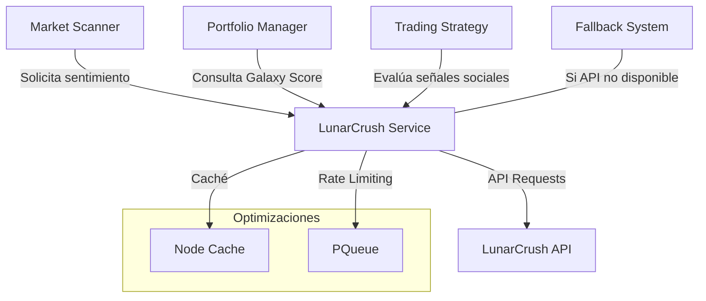

# Integración con LunarCrush

LunarCrush es un servicio que proporciona análisis de sentimiento social para criptomonedas. Este documento describe cómo midasTS integra LunarCrush para obtener datos de sentimiento que mejoran las decisiones de trading.

## Funcionalidades Principales

- **Galaxy Score**: Obtención de puntuación de sentimiento social (0-100)
- **Análisis de Influencers**: Identificación de voces influyentes en el mercado
- **Métricas Sociales**: Seguimiento de cambios en volumen social y sentimiento
- **Modo de Desarrollo**: Sistema alternativo de scoring para desarrollo sin API
- **Gestión Avanzada de Caché**: Optimización de uso de API y funcionamiento offline

## Arquitectura de Integración

LunarCrush se integra en el sistema a través de un servicio dedicado que gestiona la comunicación con la API:



## Galaxy Score y su Uso

El Galaxy Score es la métrica principal de LunarCrush, un valor entre 0 y 100 que indica la fortaleza del sentimiento social:

- **70-100**: Sentimiento muy positivo, potencial señal de compra
- **50-70**: Sentimiento moderadamente positivo, monitoreo
- **30-50**: Sentimiento neutral o mixto
- **0-30**: Sentimiento negativo, potencial señal de venta

El sistema utiliza Galaxy Score en múltiples puntos:

1. **Escáner de Mercado**: Forma parte del algoritmo de puntuación para detectar oportunidades
2. **Evaluación de Rotaciones**: Factor en decisiones de rotación de portafolio
3. **Confirmación de DeepSeek**: Enriquece el contexto para decisiones de la IA

## Implementación Técnica

### Sistema de Caché en Dos Niveles

El servicio implementa un sistema de caché para reducir llamadas a la API y permitir operación offline:

```typescript
// Caché para Galaxy Score
this.galaxyScoreCache = new NodeCache({ stdTTL: cacheTTL });

// Caché para otros datos (influencers, métricas sociales)
this.dataCache = new NodeCache({ stdTTL: cacheTTL });
```

### Control de Rate Limiting

Un sistema de cola gestiona las solicitudes para evitar exceder los límites de la API:

```typescript
// Crear cola con límites de tasa
this.queue = new PQueue({
  concurrency: 1, // Una solicitud a la vez
  intervalCap: maxRequestsPerMinute,
  interval: 60 * 1000, // 1 minuto
  carryoverConcurrencyCount: true
});
```

### Tolerancia a Fallos

El sistema maneja elegantemente situaciones donde la API no está disponible:

1. **Verificación Automática**: Comprueba disponibilidad de la API al iniciar
2. **Sistema Alternativo**: Si la API falla, usa un algoritmo alternativo para generar scores
3. **Recuperación Automática**: Intenta reconectar en futuras solicitudes

```typescript
// Si la API no está disponible, usar sistema alternativo
if (!this.apiAvailable) {
  return this.getAlternativeScore(assetUpperCase);
}
```

### Sistema Alternativo de Scoring

Para desarrollo o cuando la API no está disponible, el sistema implementa un generador alternativo:

```typescript
private getAlternativeScore(asset: string): number {
  // Generar un valor basado en la hora del día y características del activo
  const hourFactor = date.getHours() / 24;
  const dayFactor = date.getDate() / 31;
  const assetFactor = (assetSeed % 10) / 10;
  
  // Calcular valor final (rango neutral con variabilidad)
  const finalScore = Math.round(baseScore + assetFactor * 10);
  
  return Math.max(0, Math.min(100, finalScore));
}
```

## Datos Enriquecidos de Sentimiento

Además del Galaxy Score básico, el sistema puede obtener información extendida de sentimiento:

```typescript
interface EnhancedSentiment {
  galaxyScore: number;
  altRank?: number;
  socialVolumeChange24h?: number;
  bearishSentiment?: number;
  bullishSentiment?: number;
  topInfluencers?: Array<{name: string, followers: number, sentiment: string}>;
}
```

Estos datos proporcionan contexto adicional para decisiones más precisas:

- **AltRank**: Ranking alternativo basado en métricas sociales
- **Cambio en Volumen Social**: Indica creciente interés en el activo
- **Sentimiento Alcista/Bajista**: Proporción de opiniones positivas vs negativas
- **Influencers Principales**: Identificación de figuras clave discutiendo el activo

## Señales de Trading basadas en Sentimiento

El sistema puede generar señales de trading basadas exclusivamente en datos de sentimiento:

```typescript
async getMicroTradingSignal(asset: string): Promise<{
  score: number;
  threshold: number;
  signal: 'STRONG_BUY' | 'BUY' | 'NEUTRAL' | 'SELL' | 'STRONG_SELL';
}>
```

Estas señales siguen una lógica especializada para micro-capital:

- Umbrales más estrictos que el trading tradicional
- Mayor peso a cambios drásticos en sentimiento
- Integración con otros factores técnicos

## Configuración

La configuración del servicio se realiza a través de variables de entorno:

```
# LunarCrush API
LUNAR_KEY=your_api_key_here
```

Parámetros adicionales configurables:

| Parámetro | Descripción | Valor por defecto |
|-----------|-------------|-------------------|
| `cacheTTL` | Tiempo de vida de caché (segundos) | 300 (5 minutos) |
| `maxRequestsPerMinute` | Límite de solicitudes por minuto | 9 |

## Mejores Prácticas

1. **Uso Complementario**: Utilizar sentimiento social como un factor más, no como único criterio
2. **Correlación con Indicadores Técnicos**: Buscar confirmación entre sentimiento y patrones técnicos
3. **Monitoreo de Cambios Repentinos**: Prestar atención a cambios dramáticos en el sentimiento
4. **Validación Cruzada**: Contrastar con otras fuentes de sentimiento cuando sea posible

## Limitaciones y Consideraciones

- **Disponibilidad de la API**: La calidad del servicio depende de la disponibilidad de LunarCrush
- **Cobertura de Activos**: Algunos activos menos populares pueden tener datos limitados
- **Latencia de Datos**: El sentimiento social puede tener cierto retraso respecto al precio
- **Sensibilidad a Ruido**: Eventos mediáticos pueden causar distorsiones temporales

## Desarrollo Futuro

Posibles mejoras planificadas:

1. **Análisis de Tendencias**: Seguimiento de cambios en sentimiento a lo largo del tiempo
2. **Correlación Histórica**: Análisis de correlación entre sentimiento y movimientos de precio
3. **Filtros de Calidad**: Mejora en la identificación de sentimiento genuino vs artificial
4. **Integración con IA**: Análisis de texto avanzado para interpretar comentarios sociales
