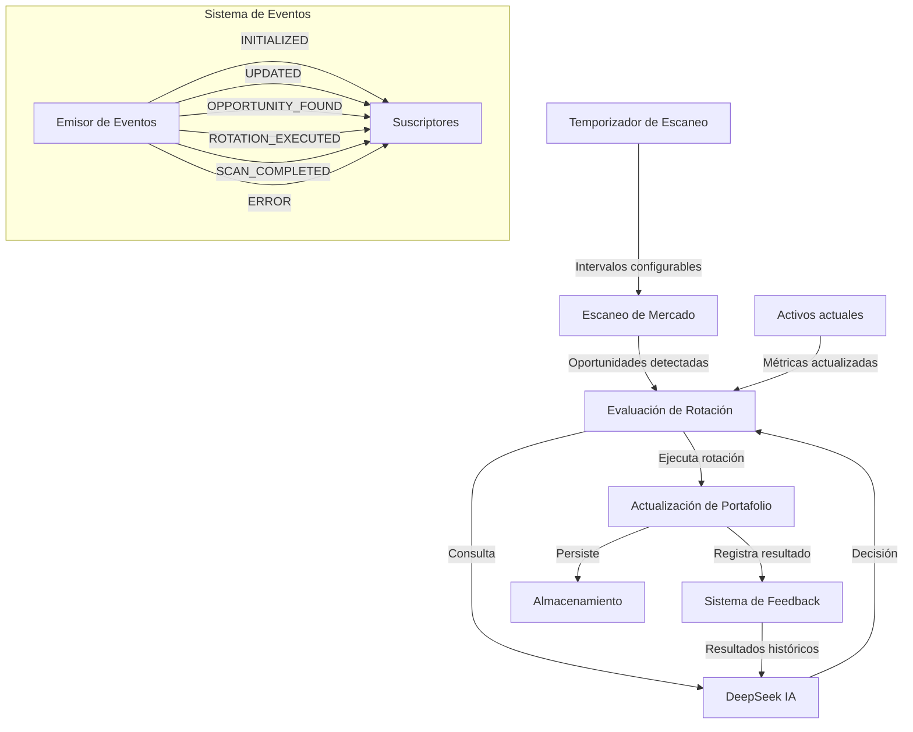

# Gestor Dinámico de Portafolio

El Gestor Dinámico de Portafolio es el componente central del sistema de rotación automática de activos. Utiliza DeepSeek como núcleo de toma de decisiones para optimizar continuamente la composición del portafolio.

## Funcionalidades Principales

- **Monitoreo continuo del mercado** para detectar nuevas oportunidades
- **Rotación automática de activos** basada en decisiones de DeepSeek y análisis técnico
- **Diversificación optimizada** mediante análisis de correlaciones
- **Gestión de efectivo** para mantener reservas estratégicas
- **Registro de rotaciones históricas** para análisis de rendimiento
- **Integración con sistema de feedback** para mejora continua de decisiones
- **Arquitectura basada en eventos** para extensibilidad y observabilidad

## Arquitectura

El Gestor de Portafolio funciona como un sistema de eventos que:

1. Escanea periódicamente el mercado en busca de oportunidades
2. Actualiza las métricas de los activos en el portafolio
3. Evalúa si hay oportunidades que merezcan rotación
4. Consulta a DeepSeek para validar las decisiones de rotación
5. Ejecuta rotaciones cuando se identifica una oportunidad superior
6. Mantiene un historial de rotaciones y rendimiento
7. Registra datos en el sistema de feedback para mejorar decisiones futuras



## Eventos del Sistema

El sistema emite los siguientes eventos que pueden ser monitoreados:

- `INITIALIZED`: Cuando el portafolio se inicializa
- `UPDATED`: Cuando se actualiza el estado del portafolio
- `OPPORTUNITY_FOUND`: Cuando se detecta una oportunidad de rotación
- `ROTATION_EXECUTED`: Cuando se ejecuta una rotación
- `SCAN_COMPLETED`: Cuando finaliza un escaneo de mercado
- `ERROR`: Cuando ocurre un error en algún proceso

Estos eventos permiten:
- Desarrollar interfaces de usuario reactivas
- Implementar análisis de rendimiento en tiempo real
- Crear alertas personalizadas
- Extender el sistema con módulos adicionales

## Parámetros de Configuración

| Parámetro | Descripción | Valor por defecto |
|-----------|-------------|-------------------|
| `capital` | Capital inicial | - |
| `dataDir` | Directorio para datos | `./data` |
| `scanIntervalMinutes` | Intervalo entre escaneos | `15` |
| `rotationThreshold` | Umbral de confianza | `0.85` |
| `forceDiversification` | Forzar diversificación | `true` |
| `cashReservePercent` | Porcentaje de efectivo | `15` |
| `maxPositions` | Posiciones máximas | `2` |
| `saveToFile` | Guardar estado en archivo | `true` |

## Integración con el Sistema de Feedback

El Gestor de Portafolio está estrechamente integrado con el [Sistema de Feedback](feedback-system.md) para mejorar continuamente sus decisiones:

1. **Registro de resultados**: Cada rotación ejecutada se registra en el sistema de feedback
   ```typescript
   // Al ejecutar una rotación, registrar en el sistema de feedback
   await this.executeRotation(candidate);
   // Después, registrar el resultado
   feedbackStore.recordFeedback({
     originalSignal: deepSeekSignal,
     marketData: marketData,
     result: {
       symbol: opportunity.symbol,
       action: 'BUY',
       // Otros datos del resultado...
     },
     successful: true
   });
   ```

2. **Consulta de historial**: Al evaluar rotaciones, se consulta el historial de éxito
   ```typescript
   // Al evaluar una rotación, obtener estadísticas históricas
   const symbolStats = feedbackStore.getSuccessRateForSymbol(symbol);
   const recentFeedback = feedbackStore.getRelevantFeedback(symbol, 'BUY');
   
   // Incluir estadísticas en la consulta a DeepSeek
   const rotationDecision = await this.requestPortfolioRotationDecision(
     worstAsset, 
     bestOpportunity,
     symbolStats,
     recentFeedback
   );
   ```

3. **Adaptación de estrategias**: Las estadísticas de rendimiento influyen en decisiones futuras
   - Mayor confianza en activos con historial exitoso
   - Ajuste automático de parámetros basado en resultados previos
   - Correlación de condiciones de mercado con resultados

## Gestión de Rotaciones

### Proceso de Evaluación de Rotaciones

1. Se actualiza el portafolio existente con los precios actuales
2. Se escanea el mercado para obtener nuevas oportunidades
3. Se compara el potencial de las nuevas oportunidades con los activos actuales
4. Se consulta a DeepSeek para el análisis final y decisión, incluyendo datos de feedback
5. Si la confianza supera el umbral configurado, se ejecuta la rotación

### Ejemplo de Prompt a DeepSeek

```
Eres un experto en rotación de capital para maximizar crecimiento en carteras de cripto.

CONTEXTO:
- Capital total: $54.00 USD
- Tipo de cartera: Crecimiento acelerado

ACTIVO ACTUAL EN CARTERA:
- Símbolo: BTCUSDT
- Precio: 75432.50
- Asignación: $25.00 (46.3% del capital)
- Rendimiento actual: 3.5%
- Galaxy Score: 75/100
- Potencial de retorno estimado: 2.2%
- Volatilidad: 1.5%
- Momentum: 65/100
- RSI: 58
- Tendencia EMA: bullish
- Posición en Bollinger Bands: 0.65

NUEVA OPORTUNIDAD DETECTADA:
- Símbolo: SOLUSDT
- Precio: 135.20
- Galaxy Score: 85/100
- Potencial de retorno estimado: 3.5%
- Score algorítmico: 0.88
- RSI: 48
- Tendencia EMA: bullish
- Posición en Bollinger Bands: 0.30

INSTRUCCIONES:
1. Analiza si vale la pena rotar el capital desde el activo actual hacia la nueva oportunidad
2. Considera rendimiento pasado, potencial futuro, momentum y situación técnica
3. Para decisiones de crecimiento acelerado, prioriza potencial futuro y momentum
```

## Operaciones Manuales

El sistema permite al usuario forzar rotaciones manuales mediante el método `forceRotation(symbol, amount, exitSymbol)`:

- `symbol`: Símbolo al que rotar (ej: 'SOLUSDT')
- `amount` (opcional): Cantidad específica a invertir
- `exitSymbol` (opcional): Símbolo específico del que salir

## Persistencia

El sistema mantiene persistencia mediante almacenamiento en archivo JSON, guardando:

- Estado actual del portafolio
- Historial de rotaciones
- Métricas de rendimiento

Esto permite reiniciar el sistema manteniendo el estado anterior.
