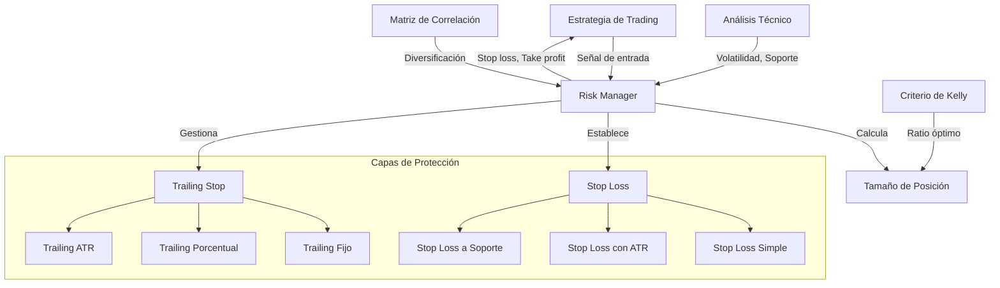

# Gestión de Riesgo

La gestión de riesgo es un componente crítico en midasTS, especialmente importante para operaciones con micro-capital donde la preservación del capital es prioritaria. Este documento describe las estrategias implementadas para proteger el capital y optimizar el rendimiento ajustado al riesgo.

## Funcionalidades Principales

- **Stop Loss Dinámico**: Cálculo preciso basado en volatilidad real del mercado
- **Trailing Stop**: Protección de ganancias con seguimiento del precio
- **Dimensionamiento Óptimo**: Cálculo de tamaño de posición mediante Criterio de Kelly
- **Diversificación Inteligente**: Análisis de correlación para reducir riesgo sistémico
- **Protección de Capital**: Múltiples capas de seguridad para preservar el capital inicial

## Arquitectura del Sistema de Gestión de Riesgo



## Estrategias de Stop Loss

### 1. Stop Loss Basado en ATR

El ATR (Average True Range) proporciona una medida precisa de la volatilidad, permitiendo establecer stops que evitan ser alcanzados por movimientos normales del mercado.

```typescript
export function calculateATRStopLoss(
  entryPrice: number,
  isLong: boolean,
  candles: CandleData[],
  multiplier: number = 1.5
): number {
  // Calcular ATR
  const atr = TechnicalIndicators.calculateATR(candles);
  
  // Convertir ATR de porcentaje a valor absoluto
  const atrValue = entryPrice * (atr / 100);
  
  // Calcular distancia de stop loss (1.5x ATR por defecto)
  const stopDistance = atrValue * multiplier;
  
  // Establecer stop loss según dirección de la operación
  return isLong 
    ? entryPrice - stopDistance  // Para posiciones largas, por debajo del precio
    : entryPrice + stopDistance; // Para posiciones cortas, por encima del precio
}
```

### 2. Stop Loss a Nivel de Soporte/Resistencia

Utiliza niveles técnicos significativos para colocar stops en puntos donde el precio ha encontrado soporte o resistencia previamente.

```typescript
export function calculateSupportStopLoss(
  entryPrice: number,
  isLong: boolean,
  candles: CandleData[]
): number {
  // Encontrar niveles de soporte y resistencia
  const { supports, resistances } = TechnicalIndicators.findSupportResistanceLevels(candles);
  
  if (isLong) {
    // Para posiciones largas, buscar soporte por debajo del precio de entrada
    const relevantSupports = supports.filter(level => level < entryPrice);
    
    if (relevantSupports.length > 0) {
      // Ordenar soportes de mayor a menor
      relevantSupports.sort((a, b) => b - a);
      
      // Usar el soporte más cercano pero con un margen de seguridad
      const stopLoss = relevantSupports[0] * 0.995; // 0.5% por debajo del soporte
      
      // Limitar la pérdida máxima al 3% (protección adicional)
      const maxLossStop = entryPrice * 0.97;
      
      // Usar el más alto de los dos (menor pérdida)
      return Math.max(stopLoss, maxLossStop);
    }
  } else {
    // Para posiciones cortas, buscar resistencia por encima del precio de entrada
    const relevantResistances = resistances.filter(level => level > entryPrice);
    
    if (relevantResistances.length > 0) {
      // Ordenar resistencias de menor a mayor
      relevantResistances.sort((a, b) => a - b);
      
      // Usar la resistencia más cercana pero con un margen de seguridad
      const stopLoss = relevantResistances[0] * 1.005; // 0.5% por encima de la resistencia
      
      // Limitar la pérdida máxima al 3%
      const maxLossStop = entryPrice * 1.03;
      
      // Usar el más bajo de los dos (menor pérdida)
      return Math.min(stopLoss, maxLossStop);
    }
  }
  
  // Si no hay niveles cercanos, volver al método ATR
  return calculateATRStopLoss(entryPrice, isLong, candles);
}
```

### 3. Stop Loss Combinado (Inteligente)

Combina múltiples métodos para determinar el stop loss más efectivo:

```typescript
export function calculateOptimalStopLoss(
  entryPrice: number,
  isLong: boolean,
  candles: CandleData[],
  capital: number
): number {
  // Calcular diferentes tipos de stop loss
  const atrStop = calculateATRStopLoss(entryPrice, isLong, candles);
  const supportStop = calculateSupportStopLoss(entryPrice, isLong, candles);
  
  // Calcular porcentaje de pérdida para cada método
  const atrLossPercent = Math.abs(entryPrice - atrStop) / entryPrice;
  const supportLossPercent = Math.abs(entryPrice - supportStop) / entryPrice;
  
  // Para micro-capital (<$100), limitar pérdida máxima a 2%
  const maxAllowedLoss = capital < 100 ? 0.02 : 0.03;
  
  // Si ambos stops implican una pérdida mayor que la permitida,
  // usar el límite de pérdida máxima
  if (atrLossPercent > maxAllowedLoss && supportLossPercent > maxAllowedLoss) {
    return isLong
      ? entryPrice * (1 - maxAllowedLoss)
      : entryPrice * (1 + maxAllowedLoss);
  }
  
  // De lo contrario, usar el más conservador (el que resulte en menor pérdida)
  if (isLong) {
    // Para posiciones largas, el stop más alto (más cercano al precio de entrada)
    return Math.max(atrStop, supportStop);
  } else {
    // Para posiciones cortas, el stop más bajo (más cercano al precio de entrada)
    return Math.min(atrStop, supportStop);
  }
}
```

## Sistema de Trailing Stop

El trailing stop "sigue" el precio cuando se mueve a favor de la operación, protegiendo las ganancias:

```typescript
export interface TrailingStopConfig {
  type: 'fixed' | 'percentage' | 'atr';
  value: number;  // Valor fijo, porcentaje o multiplicador de ATR
  activation: number; // Porcentaje de ganancia para activar trailing
}

export class TrailingStopManager {
  private trailingLevel: number | null = null;
  private activated: boolean = false;
  private config: TrailingStopConfig;
  private initialPrice: number;
  private atrValue: number | null = null;
  private isLong: boolean;
  
  constructor(
    entryPrice: number, 
    isLong: boolean,
    config: TrailingStopConfig,
    candles?: CandleData[]
  ) {
    this.initialPrice = entryPrice;
    this.isLong = isLong;
    this.config = config;
    
    // Si es trailing basado en ATR, calcular valor
    if (config.type === 'atr' && candles) {
      const atr = TechnicalIndicators.calculateATR(candles);
      this.atrValue = this.initialPrice * (atr / 100) * config.value;
    }
  }
  
  /**
   * Actualiza el nivel de trailing stop según el precio actual
   * @param currentPrice Precio actual
   * @returns El nuevo nivel de stop, o null si no hay cambios
   */
  update(currentPrice: number): number | null {
    // Calcular ganancia/pérdida actual
    const priceChange = this.isLong
      ? (currentPrice - this.initialPrice) / this.initialPrice
      : (this.initialPrice - currentPrice) / this.initialPrice;
    
    // Si aún no está activado, comprobar si debe activarse
    if (!this.activated) {
      if (priceChange >= this.config.activation) {
        this.activated = true;
      } else {
        return null; // No activado aún
      }
    }
    
    // Calcular nuevo nivel de stop
    let newStopLevel: number;
    
    if (this.config.type === 'fixed') {
      // Valor fijo de distancia
      newStopLevel = this.isLong
        ? currentPrice - this.config.value
        : currentPrice + this.config.value;
    } else if (this.config.type === 'percentage') {
      // Porcentaje del precio actual
      newStopLevel = this.isLong
        ? currentPrice * (1 - this.config.value / 100)
        : currentPrice * (1 + this.config.value / 100);
    } else { // 'atr'
      // Basado en ATR
      newStopLevel = this.isLong
        ? currentPrice - (this.atrValue || currentPrice * 0.01)
        : currentPrice + (this.atrValue || currentPrice * 0.01);
    }
    
    // Verificar si el nuevo nivel mejora el nivel actual
    if (this.trailingLevel === null || 
        (this.isLong && newStopLevel > this.trailingLevel) || 
        (!this.isLong && newStopLevel < this.trailingLevel)) {
      this.trailingLevel = newStopLevel;
      return newStopLevel;
    }
    
    return this.trailingLevel; // Mantener nivel actual
  }
  
  /**
   * Verifica si el precio actual ha alcanzado el nivel de stop
   * @param currentPrice Precio actual
   * @returns true si el stop ha sido alcanzado
   */
  isTriggered(currentPrice: number): boolean {
    if (!this.activated || this.trailingLevel === null) {
      return false;
    }
    
    return this.isLong
      ? currentPrice <= this.trailingLevel
      : currentPrice >= this.trailingLevel;
  }
}
```

## Dimensionamiento de Posiciones con Criterio de Kelly

El sistema utiliza una implementación adaptada del Criterio de Kelly para optimizar el tamaño de las posiciones:

```typescript
export function calculateKellyPositionSize(
  capital: number,
  winRate: number,  // Probabilidad de ganar (0-1)
  payoffRatio: number, // Ratio ganancia promedio / pérdida promedio
  maxRiskPercent: number = 2 // Máximo riesgo permitido como porcentaje
): number {
  // Fórmula de Kelly: f* = (bp - q) / b
  // Donde: b = payoffRatio, p = winRate, q = 1 - winRate
  
  // Si no hay datos suficientes, usar posición conservadora
  if (!winRate || !payoffRatio || winRate <= 0 || payoffRatio <= 0) {
    return capital * 0.1; // 10% del capital como fallback seguro
  }
  
  // Calcular fracción de Kelly
  const kellyFraction = (payoffRatio * winRate - (1 - winRate)) / payoffRatio;
  
  // Aplicar restricciones para micro-capital
  // 1. No usar nunca más del 25% del capital
  // 2. Usar media-Kelly (más conservador)
  // 3. Respetar el máximo riesgo permitido
  const reducedKelly = kellyFraction * 0.5; // Media-Kelly
  const maxAllowedSize = capital * 0.25; // Máximo 25% del capital
  
  // Calcular tamaño según riesgo máximo permitido
  const riskBasedSize = (capital * (maxRiskPercent / 100)) / (1 - payoffRatio);
  
  // Tomar el valor más restrictivo
  const positionSize = Math.min(
    capital * reducedKelly,
    maxAllowedSize,
    riskBasedSize
  );
  
  // Garantizar un valor positivo
  return Math.max(positionSize, 0);
}
```

## Diversificación Inteligente

El sistema utiliza análisis de correlación para reducir el riesgo mediante diversificación:

```typescript
export async function optimizePortfolioDiversification(
  opportunities: MarketOpportunity[],
  maxPositions: number = 3
): Promise<MarketOpportunity[]> {
  if (opportunities.length <= maxPositions) {
    return opportunities; // No hay necesidad de optimizar
  }
  
  // Obtener matriz de correlación para las oportunidades
  const symbols = opportunities.map(op => op.symbol);
  const correlationMatrix = await correlationService.getCorrelationMatrix(symbols);
  
  // Algoritmo de selección basado en correlación y puntuación
  const selected: MarketOpportunity[] = [opportunities[0]]; // Comenzar con la mejor oportunidad
  
  // Seleccionar el resto basándose en baja correlación y alta puntuación
  while (selected.length < maxPositions && selected.length < opportunities.length) {
    let bestCandidate: MarketOpportunity | null = null;
    let bestScore = -Infinity;
    
    // Evaluar cada oportunidad no seleccionada
    for (const opportunity of opportunities) {
      // Omitir si ya está seleccionada
      if (selected.some(s => s.symbol === opportunity.symbol)) {
        continue;
      }
      
      // Calcular correlación promedio con activos seleccionados
      let totalCorrelation = 0;
      for (const selectedOp of selected) {
        const correlation = correlationMatrix.getCorrelation(
          opportunity.symbol, 
          selectedOp.symbol
        ) || 0.5; // Valor por defecto si no hay datos
        
        totalCorrelation += correlation;
      }
      
      const avgCorrelation = totalCorrelation / selected.length;
      
      // Combinar puntuación original y baja correlación (1 - correlación)
      const diversificationBonus = 1 - avgCorrelation;
      const combinedScore = opportunity.score * 0.7 + diversificationBonus * 0.3;
      
      // Actualizar si es mejor candidato
      if (combinedScore > bestScore) {
        bestScore = combinedScore;
        bestCandidate = opportunity;
      }
    }
    
    // Añadir mejor candidato a la selección
    if (bestCandidate) {
      selected.push(bestCandidate);
    } else {
      break; // No se encontró candidato válido
    }
  }
  
  return selected;
}
```

## Gestión de Efectivo y Reservas

El sistema mantiene siempre un porcentaje del capital como reserva de efectivo:

```typescript
export function calculateCashReserve(
  totalCapital: number,
  riskLevel: 'conservative' | 'moderate' | 'aggressive' = 'moderate'
): number {
  // Porcentajes de reserva según nivel de riesgo
  const reservePercent = {
    conservative: 25, // 25% en efectivo
    moderate: 15,     // 15% en efectivo
    aggressive: 10    // 10% en efectivo
  };
  
  // Aplicar porcentaje según nivel de riesgo
  return totalCapital * (reservePercent[riskLevel] / 100);
}
```

## Ajustes Específicos para Micro-Capital

Para operaciones con micro-capital (<$100), el sistema aplica reglas específicas:

### 1. Limitación de Máxima Pérdida

```typescript
export function enforceMaxLossLimit(
  capital: number,
  potentialLoss: number
): boolean {
  // Definir límites de pérdida basados en capital
  let maxLossPercent: number;
  
  if (capital < 100) {
    maxLossPercent = 1.5; // 1.5% para micro-capital
  } else if (capital < 500) {
    maxLossPercent = 2.0; // 2.0% para capital pequeño
  } else {
    maxLossPercent = 2.5; // 2.5% para capital medio
  }
  
  // Convertir a valor absoluto
  const maxLossAmount = capital * (maxLossPercent / 100);
  
  // Verificar si la pérdida potencial excede el límite
  return potentialLoss <= maxLossAmount;
}
```

### 2. Tamaño de Posición Reducido

```typescript
export function adjustPositionSizeForMicroCapital(
  capital: number,
  calculatedSize: number
): number {
  if (capital < 100) {
    // Para micro-capital, limitar a 20% del capital
    return Math.min(calculatedSize, capital * 0.2);
  } else if (capital < 200) {
    // Para capital pequeño, limitar a 25%
    return Math.min(calculatedSize, capital * 0.25);
  }
  
  // Para otro capital, usar el cálculo normal
  return calculatedSize;
}
```

## Monitoreo de Riesgo y Alertas

El sistema monitorea continuamente el nivel de riesgo y emite alertas cuando es necesario:

```typescript
export function monitorRiskLevels(portfolio: Portfolio): RiskAlert[] {
  const alerts: RiskAlert[] = [];
  
  // 1. Verificar concentración excesiva
  const maxAllocation = Math.max(...portfolio.assets.map(a => a.percentage));
  if (maxAllocation > 40) {
    alerts.push({
      type: 'concentration',
      level: 'high',
      message: `Concentración elevada: ${maxAllocation.toFixed(1)}% en un solo activo`
    });
  }
  
  // 2. Verificar correlación entre activos
  if (portfolio.assets.length > 1) {
    const highCorrelation = portfolio.correlationMatrix.some(
      row => row.some(value => value > 0.85 && value < 1)
    );
    
    if (highCorrelation) {
      alerts.push({
        type: 'correlation',
        level: 'medium',
        message: 'Alta correlación detectada entre activos'
      });
    }
  }
  
  // 3. Verificar volatilidad del mercado
  const avgVolatility = portfolio.assets.reduce(
    (sum, asset) => sum + asset.volatility, 0
  ) / portfolio.assets.length;
  
  if (avgVolatility > 5) {
    alerts.push({
      type: 'volatility',
      level: 'medium',
      message: `Volatilidad elevada: ${avgVolatility.toFixed(1)}%`
    });
  }
  
  return alerts;
}
```

## Estrategias en Condiciones Extremas de Mercado

El sistema implementa protecciones especiales para condiciones extremas:

### 1. Circuit Breaker Interno

```typescript
export function activateCircuitBreaker(
  portfolio: Portfolio,
  recentDrawdown: number
): boolean {
  // Activar circuit breaker si:
  // 1. Drawdown reciente supera umbral
  // 2. Volatilidad excesiva detectada
  
  // Thresholds según tamaño de capital
  const drawdownThreshold = portfolio.totalCapital < 100 ? 3 : 5; // %
  
  if (recentDrawdown > drawdownThreshold) {
    logger.warn({
      drawdown: recentDrawdown,
      threshold: drawdownThreshold
    }, 'Circuit breaker activado por drawdown');
    
    return true;
  }
  
  return false;
}
```

### 2. Protección de Drawdown

```typescript
export function enforceDrawdownProtection(
  portfolio: Portfolio,
  historicalPerformance: PerformanceSnapshot[]
): ProtectionAction {
  // Calcular drawdown desde máximo histórico
  const maxCapital = Math.max(
    ...historicalPerformance.map(p => p.totalCapital)
  );
  
  const currentDrawdown = (maxCapital - portfolio.totalCapital) / maxCapital * 100;
  
  // Acciones según nivel de drawdown
  if (currentDrawdown > 10) {
    return {
      type: 'reduce_exposure',
      message: 'Reducir exposición al 50% por drawdown elevado',
      targetExposure: 0.5
    };
  } else if (currentDrawdown > 5) {
    return {
      type: 'increase_cash',
      message: 'Aumentar reserva de efectivo al 25%',
      targetCashReserve: 0.25
    };
  }
  
  return { type: 'normal_operation' };
}
```

## Mejores Prácticas

1. **Posición Inicial**: Siempre iniciar con posiciones pequeñas (10-20% del capital)
2. **Diversificación**: Mantener al menos 2 activos poco correlacionados
3. **Stop Loss**: Nunca operar sin stop loss claramente definido
4. **Trailing Stop**: Activar solo después de 1.5% de ganancia
5. **Reserva de Efectivo**: Mantener siempre 15-25% del capital en efectivo
6. **Gestión de Volatilidad**: Reducir tamaño en condiciones de alta volatilidad
7. **Regla del 2%**: Para micro-capital, nunca arriesgar más del 2% en una operación

## Desarrollo Futuro

Áreas de mejora planificadas para la gestión de riesgo:

1. **Machine Learning**: Optimización de parámetros mediante ML
2. **Análisis de Escenarios**: Simulaciones de Monte Carlo para estimar riesgos
3. **Hedging Estratégico**: Implementación de coberturas para protección adicional
4. **Análisis de Sentimiento**: Incorporar datos de sentimiento para gestión de riesgo
5. **Risk Budget**: Sistema de presupuesto de riesgo dinámico
