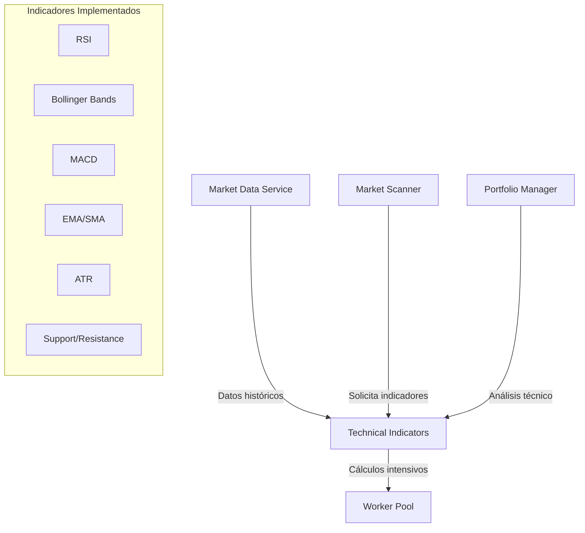

# Indicadores Técnicos

Los indicadores técnicos son una parte fundamental del sistema midasTS, proporcionando análisis cuantitativo de los datos de mercado para la toma de decisiones. Este documento describe los indicadores implementados, su configuración y uso dentro del sistema.

## Funcionalidades Principales

- **Cálculo optimizado** de indicadores técnicos estándar
- **Parámetros ajustados** para micro-capital y operaciones de corto plazo
- **Detección de patrones** en gráficos de precios
- **Procesamiento paralelo** mediante el Worker Pool
- **Combinación inteligente** para puntuación de oportunidades

## Arquitectura del Sistema de Indicadores

Los indicadores técnicos están implementados como una clase estática con métodos para cada cálculo:



## Indicadores Implementados

### 1. RSI (Relative Strength Index)

```typescript
static calculateRSI(candles: CandleData[], period: number = 14): number {
  // Verificar datos suficientes
  if (candles.length < period + 1) {
    return 50; // Valor neutral como fallback
  }
  
  let gains = 0;
  let losses = 0;
  
  // Calcular ganancias y pérdidas iniciales
  for (let i = 1; i <= period; i++) {
    const difference = candles[i].close - candles[i - 1].close;
    
    if (difference >= 0) {
      gains += difference;
    } else {
      losses -= difference;
    }
  }
  
  // Calcular valores iniciales de RS
  let avgGain = gains / period;
  let avgLoss = losses / period;
  
  // Calcular RSI para los puntos restantes
  for (let i = period + 1; i < candles.length; i++) {
    const difference = candles[i].close - candles[i - 1].close;
    
    if (difference >= 0) {
      avgGain = ((avgGain * (period - 1)) + difference) / period;
      avgLoss = (avgLoss * (period - 1)) / period;
    } else {
      avgGain = (avgGain * (period - 1)) / period;
      avgLoss = ((avgLoss * (period - 1)) - difference) / period;
    }
  }
  
  // Evitar división por cero
  if (avgLoss === 0) {
    return 100;
  }
  
  // Calcular RS y RSI
  const rs = avgGain / avgLoss;
  return 100 - (100 / (1 + rs));
}
```

#### Interpretación y Uso

El RSI (0-100) mide la velocidad y cambio de los movimientos de precio:

- **RSI > 70**: Considerado sobrecomprado, potencial señal de venta
- **RSI < 30**: Considerado sobrevendido, potencial señal de compra
- **Divergencias**: Cuando el precio y el RSI se mueven en direcciones opuestas, indica posible reversión

En midasTS, el RSI se usa con ajustes específicos para micro-capital:
- **Período más corto**: 10 en lugar del estándar 14, para mayor sensibilidad
- **Umbral adaptativo**: Los niveles varían según la volatilidad del activo
- **Combinación con volumen**: Señales de RSI confirmadas con volumen

### 2. Bandas de Bollinger

```typescript
static calculateBollingerBands(
  candles: CandleData[],
  period: number = 20,
  multiplier: number = 2
): { upper: number; middle: number; lower: number; width: number; percentB: number } {
  // Calcular SMA
  const prices = candles.map(c => c.close);
  const sma = this.calculateSMA(prices, period);
  
  // Calcular desviación estándar
  let sum = 0;
  for (let i = prices.length - period; i < prices.length; i++) {
    sum += Math.pow(prices[i] - sma, 2);
  }
  const stdDev = Math.sqrt(sum / period);
  
  // Calcular bandas
  const upper = sma + (multiplier * stdDev);
  const lower = sma - (multiplier * stdDev);
  const width = (upper - lower) / sma;
  
  // Calcular %B (posición dentro de las bandas)
  const currentPrice = prices[prices.length - 1];
  const percentB = (currentPrice - lower) / (upper - lower);
  
  return { upper, middle: sma, lower, width, percentB };
}
```

#### Interpretación y Uso

Las Bandas de Bollinger proporcionan información sobre volatilidad y niveles relativos:

- **Estrechamiento de bandas**: Indica baja volatilidad, posible expansión inminente
- **Expansión de bandas**: Indica alta volatilidad
- **Precio cerca de banda superior**: Posible sobrecompra
- **Precio cerca de banda inferior**: Posible sobreventa
- **%B**: Indica posición dentro de las bandas (0-1)

En midasTS, las Bandas de Bollinger se usan para:
- **Estimación de retorno potencial**: Basado en la posición dentro de las bandas
- **Identificación de volatilidad**: Para ajustar tamaño de posiciones
- **Puntos de entrada y salida**: Señales en conjunción con otros indicadores

### 3. Medias Móviles (SMA/EMA)

```typescript
static calculateSMA(values: number[], period: number): number {
  const slicedValues = values.slice(-period);
  return slicedValues.reduce((sum, value) => sum + value, 0) / period;
}

static calculateEMA(values: number[], period: number): number[] {
  const results: number[] = [];
  const multiplier = 2 / (period + 1);
  
  // Inicializar con SMA
  results.push(this.calculateSMA(values.slice(0, period), period));
  
  // Calcular EMAs restantes
  for (let i = period; i < values.length; i++) {
    const ema = (values[i] * multiplier) + (results[results.length - 1] * (1 - multiplier));
    results.push(ema);
  }
  
  return results;
}

static detectEMACrossover(
  candles: CandleData[],
  shortPeriod: number = 9,
  longPeriod: number = 21
): 'bullish' | 'bearish' | 'neutral' {
  const prices = candles.map(c => c.close);
  const shortEMA = this.calculateEMA(prices, shortPeriod);
  const longEMA = this.calculateEMA(prices, longPeriod);
  
  // Obtener los últimos valores
  const lastShort = shortEMA[shortEMA.length - 1];
  const prevShort = shortEMA[shortEMA.length - 2];
  const lastLong = longEMA[longEMA.length - 1];
  const prevLong = longEMA[longEMA.length - 2];
  
  // Detectar cruce
  if (prevShort < prevLong && lastShort > lastLong) {
    return 'bullish'; // Cruce hacia arriba
  } else if (prevShort > prevLong && lastShort < lastLong) {
    return 'bearish'; // Cruce hacia abajo
  } else {
    return 'neutral'; // Sin cruce
  }
}
```

#### Interpretación y Uso

Las medias móviles son fundamentales para analizar tendencias:

- **Cruce de medias**: Señales de cambio de tendencia
- **Precio por encima/debajo**: Indica tendencia alcista/bajista
- **Pendiente de la media**: Indica fuerza de la tendencia

En midasTS, las medias móviles se usan con configuraciones específicas:
- **9/21 EMA**: Para detección de cruces en timeframes cortos
- **Múltiples timeframes**: Análisis simultáneo de varias escalas temporales
- **Combinación con RSI**: Señales más robustas mediante confirmación

### 4. ATR (Average True Range)

```typescript
static calculateATR(candles: CandleData[], period: number = 14): number {
  if (candles.length < period + 1) {
    return 0; // Datos insuficientes
  }
  
  // Calcular True Range para cada vela
  const trueRanges: number[] = [];
  
  for (let i = 1; i < candles.length; i++) {
    const high = candles[i].high;
    const low = candles[i].low;
    const prevClose = candles[i - 1].close;
    
    // True Range es el mayor de estos tres valores
    const tr1 = high - low;
    const tr2 = Math.abs(high - prevClose);
    const tr3 = Math.abs(low - prevClose);
    
    const trueRange = Math.max(tr1, tr2, tr3);
    trueRanges.push(trueRange);
  }
  
  // Para el primer período, usar SMA
  let atr: number;
  
  if (trueRanges.length <= period) {
    // Calcular SMA si no hay suficientes datos
    const sum = trueRanges.reduce((total, value) => total + value, 0);
    atr = sum / trueRanges.length;
  } else {
    // Calcular ATR inicial (SMA del primer período)
    let sum = 0;
    for (let i = 0; i < period; i++) {
      sum += trueRanges[i];
    }
    let prevATR = sum / period;
    
    // Calcular ATR final usando la fórmula de suavizado
    for (let i = period; i < trueRanges.length; i++) {
      prevATR = ((prevATR * (period - 1)) + trueRanges[i]) / period;
    }
    
    atr = prevATR;
  }
  
  // Convertir a porcentaje para facilitar interpretación
  const currentPrice = candles[candles.length - 1].close;
  return (atr / currentPrice) * 100;
}
```

#### Interpretación y Uso

El ATR mide la volatilidad del mercado:

- **ATR alto**: Mayor volatilidad
- **ATR bajo**: Menor volatilidad
- **Cambio repentino en ATR**: Posible inicio de nuevo movimiento

En midasTS, el ATR se usa para:
- **Dimensionamiento de posiciones**: Ajustar tamaño según volatilidad
- **Cálculo de stop loss**: Colocar stops basados en volatilidad real
- **Estimación de retorno potencial**: Mayor volatilidad → potencial mayor retorno

### 5. Soportes y Resistencias

```typescript
static findSupportResistanceLevels(
  candles: CandleData[],
  lookback: number = 50,
  deviation: number = 0.3
): { supports: number[]; resistances: number[] } {
  // Extraer precios high y low
  const highs = candles.map(c => c.high);
  const lows = candles.map(c => c.low);
  
  // Preparar arrays para niveles
  let supports: number[] = [];
  let resistances: number[] = [];
  
  // Encontrar potenciales niveles de soporte
  for (let i = lookback; i < lows.length - lookback; i++) {
    const current = lows[i];
    let isSupport = true;
    
    // Verificar si es mínimo local
    for (let j = i - lookback; j < i; j++) {
      if (lows[j] < current) {
        isSupport = false;
        break;
      }
    }
    
    for (let j = i + 1; j < i + lookback; j++) {
      if (lows[j] < current) {
        isSupport = false;
        break;
      }
    }
    
    if (isSupport) {
      supports.push(current);
    }
  }
  
  // Encontrar potenciales niveles de resistencia
  for (let i = lookback; i < highs.length - lookback; i++) {
    const current = highs[i];
    let isResistance = true;
    
    // Verificar si es máximo local
    for (let j = i - lookback; j < i; j++) {
      if (highs[j] > current) {
        isResistance = false;
        break;
      }
    }
    
    for (let j = i + 1; j < i + lookback; j++) {
      if (highs[j] > current) {
        isResistance = false;
        break;
      }
    }
    
    if (isResistance) {
      resistances.push(current);
    }
  }
  
  // Agrupar niveles cercanos
  supports = this.clusterLevels(supports, deviation);
  resistances = this.clusterLevels(resistances, deviation);
  
  // Ordenar niveles desde más cercano al precio actual
  const currentPrice = candles[candles.length - 1].close;
  
  supports.sort((a, b) => b - a); // Descendente (más altos primero)
  resistances.sort((a, b) => a - b); // Ascendente (más bajos primero)
  
  return { supports, resistances };
}

private static clusterLevels(levels: number[], deviation: number): number[] {
  // Agrupar niveles que están dentro de cierto porcentaje de desviación
  const clusters: number[][] = [];
  
  for (const level of levels) {
    let addedToCluster = false;
    
    for (const cluster of clusters) {
      const clusterAvg = cluster.reduce((sum, val) => sum + val, 0) / cluster.length;
      
      if (Math.abs(level - clusterAvg) / clusterAvg < deviation / 100) {
        cluster.push(level);
        addedToCluster = true;
        break;
      }
    }
    
    if (!addedToCluster) {
      clusters.push([level]);
    }
  }
  
  // Calcular promedio de cada cluster
  return clusters.map(cluster => 
    cluster.reduce((sum, val) => sum + val, 0) / cluster.length
  );
}
```

#### Interpretación y Uso

Los niveles de soporte y resistencia son cruciales para identificar puntos de entrada y salida:

- **Soporte**: Nivel donde históricamente el precio deja de caer
- **Resistencia**: Nivel donde históricamente el precio deja de subir
- **Ruptura de nivel**: Señal potencial de continuación de tendencia
- **Rebote en nivel**: Confirmación de la importancia del nivel

En midasTS, los soportes y resistencias se usan para:
- **Identificación de puntos de entrada**: Entrar en rebotes sobre soporte
- **Establecimiento de objetivos**: Tomar beneficios en resistencias
- **Calculo de risk/reward**: Basado en distancia a soportes/resistencias
- **Confirmación de señales**: Mayor peso a señales cerca de niveles clave

## Cálculo de Momentum

```typescript
static calculateMomentumScore(candles: CandleData[]): number {
  if (candles.length < 2) {
    return 50; // Valor neutral por defecto
  }
  
  // Calcular varios indicadores de momentum
  const rsi = this.calculateRSI(candles);
  const ema9 = this.calculateEMA(candles.map(c => c.close), 9);
  const ema21 = this.calculateEMA(candles.map(c => c.close), 21);
  
  const currentPrice = candles[candles.length - 1].close;
  const lastEma9 = ema9[ema9.length - 1];
  const lastEma21 = ema21[ema21.length - 1];
  
  // Componentes de la puntuación
  let score = 0;
  
  // 1. RSI (0-30 pts)
  if (rsi > 70) score += 25;
  else if (rsi > 60) score += 20;
  else if (rsi > 50) score += 15;
  else if (rsi > 40) score += 10;
  else if (rsi > 30) score += 5;
  
  // 2. Posición relativa a EMAs (0-40 pts)
  if (currentPrice > lastEma9 && lastEma9 > lastEma21) {
    // Precio sobre EMA9 sobre EMA21 (muy alcista)
    score += 40;
  } else if (currentPrice > lastEma9) {
    // Precio sobre EMA9 (moderadamente alcista)
    score += 30;
  } else if (currentPrice > lastEma21) {
    // Precio sobre EMA21 (ligeramente alcista)
    score += 20;
  } else if (lastEma9 > lastEma21) {
    // EMA9 sobre EMA21 (posible cambio alcista)
    score += 10;
  }
  
  // 3. Análisis de tendencia reciente (0-30 pts)
  let upCandles = 0;
  for (let i = candles.length - 5; i < candles.length; i++) {
    if (i >= 0 && candles[i].close > candles[i].open) {
      upCandles++;
    }
  }
  
  score += upCandles * 6; // 0-30 pts basado en cantidad de velas alcistas recientes
  
  return score; // 0-100
}
```

## Optimización para Micro-Capital

Los indicadores están ajustados específicamente para optimizar operaciones con capital pequeño:

1. **Períodos más cortos**:
   - RSI: 10 en vez de 14
   - EMA: 9/21 en vez de 12/26
   - Bollinger Bands: 14 en vez de 20

2. **Mayor sensibilidad**:
   - Multiplicador BB: 1.8 en vez de 2.0
   - Niveles RSI ajustados: 65/35 en vez de 70/30

3. **Combinaciones optimizadas**:
   - Puntuación de momentum personalizada
   - Evaluación conjunta de múltiples indicadores
   - Peso ponderado según condiciones de mercado

## Uso de Indicadores en el Workflow 

### 1. Escáner de Mercado

```typescript
// En market-scanner.ts
const technicals = await TechnicalIndicators.calculateAll(candles);

// Puntuación basada en indicadores
let techScore = 0;

// Componente RSI (0-25 pts)
if (technicals.rsi < 30) techScore += 25; // Sobreventa fuerte
else if (technicals.rsi < 40) techScore += 20;
else if (technicals.rsi > 70) techScore -= 10; // Sobrecompra (negativo)

// Componente Bollinger Bands (0-25 pts)
if (technicals.bollingerBands.percentB < 0.1) techScore += 25; // Muy cerca banda inferior
else if (technicals.bollingerBands.percentB < 0.2) techScore += 20;
else if (technicals.bollingerBands.percentB < 0.3) techScore += 15;
else if (technicals.bollingerBands.percentB > 0.8) techScore -= 10; // Cerca banda superior (negativo)

// Componente Tendencia EMA (0-25 pts)
if (technicals.emaCross === 'bullish') techScore += 25; // Cruce alcista reciente
else if (technicals.emaCross === 'neutral' && technicals.emaDirection === 'up') techScore += 15;

// Componente Soporte/Resistencia (0-25 pts)
const nearSupport = technicals.supportsNearby.length > 0;
const nearResistance = technicals.resistancesNearby.length > 0;

if (nearSupport && !nearResistance) techScore += 25; // Soporte cercano sin resistencia
else if (nearSupport) techScore += 15; // Soporte cercano
```

### 2. DeepSeek Context

```typescript
// En deepseek.ts - Incorporación de datos técnicos al prompt
const prompt = `
ANÁLISIS TÉCNICO SOLICITADO

SÍMBOLO: ${symbol}

DATOS DE MERCADO:
- Precio actual: ${md.price}
- RSI(14): ${tech.rsi || 'N/A'}
- Tendencia EMA: ${tech.ema_cross || 'N/A'}
- Posición en Bollinger Bands: ${tech.bband_percent?.toFixed(2) || 'N/A'}
- Soportes cercanos: ${tech.supports?.join(', ') || 'N/A'}
- Resistencias cercanas: ${tech.resistances?.join(', ') || 'N/A'}
- ATR (Volatilidad): ${tech.atr || 'N/A'}
`;
```

### 3. Gestión de Riesgo

```typescript
// En risk-management.ts
// Calcular stop loss basado en ATR
const atr = TechnicalIndicators.calculateATR(candles);
const stopLossDistance = atr * 1.5; // 1.5x ATR
const stopLossPrice = entryPrice - stopLossDistance;

// Buscar soporte cercano para ajustar stop loss
const { supports } = TechnicalIndicators.findSupportResistanceLevels(candles);
const nearestSupport = supports.find(s => s < entryPrice);

// Usar el más conservador entre ATR y soporte
const finalStopLoss = nearestSupport ? 
  Math.max(stopLossPrice, nearestSupport) : 
  stopLossPrice;
```

## Procesamiento Paralelo

El cálculo de indicadores aprovecha el Worker Pool para procesamiento paralelo:

```typescript
// Registrar handler para cálculo de indicadores
registerTaskHandler('calculate-indicators', async (data) => {
  const { candles, indicators } = data;
  const results = {};
  
  // Calcular los indicadores solicitados en paralelo
  if (indicators.includes('rsi')) {
    results.rsi = TechnicalIndicators.calculateRSI(candles);
  }
  
  if (indicators.includes('bollingerBands')) {
    results.bollingerBands = TechnicalIndicators.calculateBollingerBands(candles);
  }
  
  if (indicators.includes('supportResistance')) {
    results.supportResistance = TechnicalIndicators.findSupportResistanceLevels(candles);
  }
  
  // Otros indicadores...
  
  return results;
});

// Uso desde el thread principal
const indicators = await workerPool.runTask('calculate-indicators', {
  candles: historicalData,
  indicators: ['rsi', 'bollingerBands', 'supportResistance', 'ema', 'atr']
});
```

## Visualización de Indicadores

Los indicadores calculados pueden visualizarse como parte del análisis:

```
|----- RSI(10): 32.5 -----|
|                          |
|     70 ------------------| Sobrecomprado
|                          |
|                          |
|     50 ------------------| Neutral
|                          |
|         *   *            |
|             * *          |
|     30 -----*-*----------| Sobrevendido
|               *          |
|                *         |
|--------------------------| 
```

## Recomendaciones para el Uso de Indicadores

1. **Evitar usar un solo indicador**: Siempre confirmar señales con múltiples indicadores
2. **Adaptar a condiciones de mercado**: Los parámetros óptimos varían según volatilidad
3. **Prueba y validación**: Backtestear configuraciones en diferentes escenarios
4. **Tamaños de muestra adecuados**: Usar suficientes datos para cálculos robustos
5. **Contexto de mercado**: Considerar el estado general del mercado con cada señal
