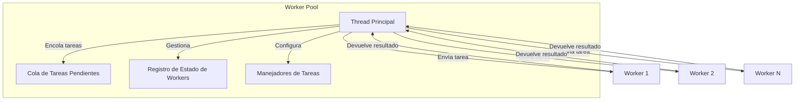

# Worker Pool para Procesamiento Paralelo

El sistema de Worker Pool implementa procesamiento paralelo eficiente utilizando Worker Threads de Node.js. Este documento explica su arquitectura, funcionamiento y casos de uso en midasTS.

## Funcionalidades Principales

- **Procesamiento Paralelo**: Aprovecha múltiples núcleos para tareas intensivas
- **Balanceo de Carga**: Distribuye tareas entre workers disponibles
- **Sistema de Cola**: Gestiona tareas pendientes cuando todos los workers están ocupados
- **Recuperación de Errores**: Reinicia workers que fallan automáticamente
- **Registro de Tareas**: Sistema de handlers para diferentes tipos de operaciones

## Arquitectura

El Worker Pool utiliza un modelo de comunicación basado en mensajes entre el thread principal y los workers:



## Implementación Técnica

### Inicialización del Pool

El pool se inicializa automáticamente con un número óptimo de workers basado en los núcleos disponibles:

```typescript
constructor(workerCount?: number) {
  // Usar número de núcleos lógicos - 1 (dejar uno para el thread principal)
  this.maxWorkers = workerCount || Math.max(1, os.cpus().length - 1);
}
```

### Comunicación mediante Mensajes

Los workers se comunican mediante un protocolo de mensajes definido:

```typescript
interface WorkerMessage {
  type: 'task' | 'result' | 'error' | 'ready';
  taskId?: string;
  taskType?: string;
  data?: any;
  result?: any;
  error?: string;
}
```

### Registro de Manejadores de Tareas

Las tareas se registran de forma global para su ejecución por cualquier worker:

```typescript
export function registerTaskHandler(type: string, handler: TaskHandler): void {
  taskHandlers[type] = handler;
  logger.debug({ taskType: type }, 'Task handler registered');
}
```

### Ejecución de Tareas en Worker Thread

Todas las tareas se ejecutan en hilos separados para no bloquear el thread principal:

```typescript
async runTask<T>(type: string, data: any): Promise<T> {
  return new Promise<T>((resolve, reject) => {
    const taskId = `task_${Date.now()}_${Math.random().toString(36).substr(2, 9)}`;
    
    // Crear tarea
    const task: Task<T> = {
      id: taskId,
      type,
      data,
      resolve,
      reject
    };
    
    // Añadir a la cola
    this.taskQueue.push(task);
    
    // Procesar cola
    this.processQueue();
  });
}
```

### Tolerancia a Fallos

El sistema maneja automáticamente fallos en los workers, recreándolos cuando es necesario:

```typescript
worker.on('error', error => {
  logger.error({ error: error.message }, 'Worker error');
  
  // Reemplazar worker
  this.workerStatus.delete(worker);
  this.workers = this.workers.filter(w => w !== worker);
  this.createWorker();
});
```

## Casos de Uso

El Worker Pool se utiliza para tareas computacionalmente intensivas:

### 1. Cálculo de Indicadores Técnicos

Un uso principal es el cálculo de indicadores técnicos complejos:

```typescript
// Registrar manejador para cálculo de indicadores
registerTaskHandler('calculate-indicators', async (data) => {
  const { candles, indicators } = data;
  const results = {};
  
  if (indicators.includes('rsi')) {
    results.rsi = calculateRSI(candles);
  }
  
  if (indicators.includes('bollingerBands')) {
    results.bollingerBands = calculateBollingerBands(candles);
  }
  
  // Otros indicadores...
  
  return results;
});

// Uso desde el thread principal
const indicators = await workerPool.runTask('calculate-indicators', {
  candles: historicalData,
  indicators: ['rsi', 'bollingerBands', 'supportResistance']
});
```

### 2. Reconocimiento de Patrones

Identifica patrones de trading en datos históricos:

```typescript
// Registrar manejador para reconocimiento de patrones
registerTaskHandler('detect-patterns', async (data) => {
  const { candles } = data;
  return {
    headAndShoulders: detectHeadAndShoulders(candles),
    doubleTop: detectDoubleTop(candles),
    doubleBottom: detectDoubleBottom(candles),
    // Otros patrones...
  };
});
```

### 3. Backtesting de Estrategias

Ejecuta pruebas de estrategias en datos históricos:

```typescript
// Registrar manejador para backtesting
registerTaskHandler('backtest-strategy', async (data) => {
  const { strategy, historicalData, parameters } = data;
  return runBacktest(strategy, historicalData, parameters);
});
```

## Optimización de Rendimiento

El Worker Pool está diseñado para maximizar el rendimiento:

### Número Óptimo de Workers

El sistema configura automáticamente un número óptimo de workers:

- **Demasiados workers**: Aumentan el overhead de comunicación y cambio de contexto
- **Muy pocos workers**: No aprovechan todos los núcleos disponibles
- **Configuración óptima**: `Número de núcleos lógicos - 1` (dejando un núcleo para el thread principal)

### Balanceo de Carga

El balanceo de carga es automático:

1. Las tareas se distribuyen a workers disponibles
2. Las tareas pendientes esperan en cola
3. Cuando un worker termina, inmediatamente recibe la siguiente tarea

### Gestión de Memoria

Para evitar problemas de memoria:

- Cada worker es un proceso independiente con su propio espacio de memoria
- Los datos se serializan/deserializan al pasar entre threads
- Los resultados grandes deben ser estructurados adecuadamente para evitar copias excesivas

## Mejores Prácticas

1. **Tareas Granulares**: Dividir operaciones grandes en tareas más pequeñas para mejor distribución
2. **Minimizar Transferencia de Datos**: Enviar solo los datos necesarios a los workers
3. **Estructuras Serializables**: Usar solo estructuras que puedan ser serializadas
4. **Evitar Estado Compartido**: Diseñar tareas autocontenidas sin dependencias de estado global
5. **Monitorizar Rendimiento**: Observar el número de tareas pendientes para detectar cuellos de botella

## Desarrollo Futuro

Posibles mejoras planificadas:

1. **Priorización de Tareas**: Añadir sistema de prioridades para tareas críticas
2. **Escalado Dinámico**: Ajustar número de workers basado en carga del sistema
3. **Persistencia de Cola**: Guardar tareas pendientes para recuperación tras reinicios
4. **Estadísticas Avanzadas**: Panel de monitoreo para rendimiento de workers
5. **Distribución Remota**: Extender para procesamiento en múltiples nodos

## Interfaz de la API

### Métodos Principales

| Método | Descripción |
|--------|-------------|
| `initialize()` | Inicializa el pool creando los workers |
| `runTask<T>(type: string, data: any)` | Ejecuta una tarea y devuelve resultado |
| `terminate()` | Detiene todos los workers |
| `get pendingTasks()` | Obtiene número de tareas pendientes |
| `get busyWorkers()` | Obtiene número de workers ocupados |

### Registro de Manejadores

```typescript
// En el archivo de registro de tareas
import { registerTaskHandler } from '../utils/worker-pool';

registerTaskHandler('task-type', async (data) => {
  // Implementación de la tarea
  return result;
});
```

### Uso en Código

```typescript
import { workerPool } from '../utils/worker-pool';

// Asegurar que el pool está inicializado
workerPool.initialize();

// Ejecutar tarea
try {
  const result = await workerPool.runTask('calculate-indicators', {
    candles: historicalData,
    indicators: ['rsi', 'macd', 'bollinger']
  });
  
  console.log('Resultado:', result);
} catch (error) {
  console.error('Error en la tarea:', error);
}
